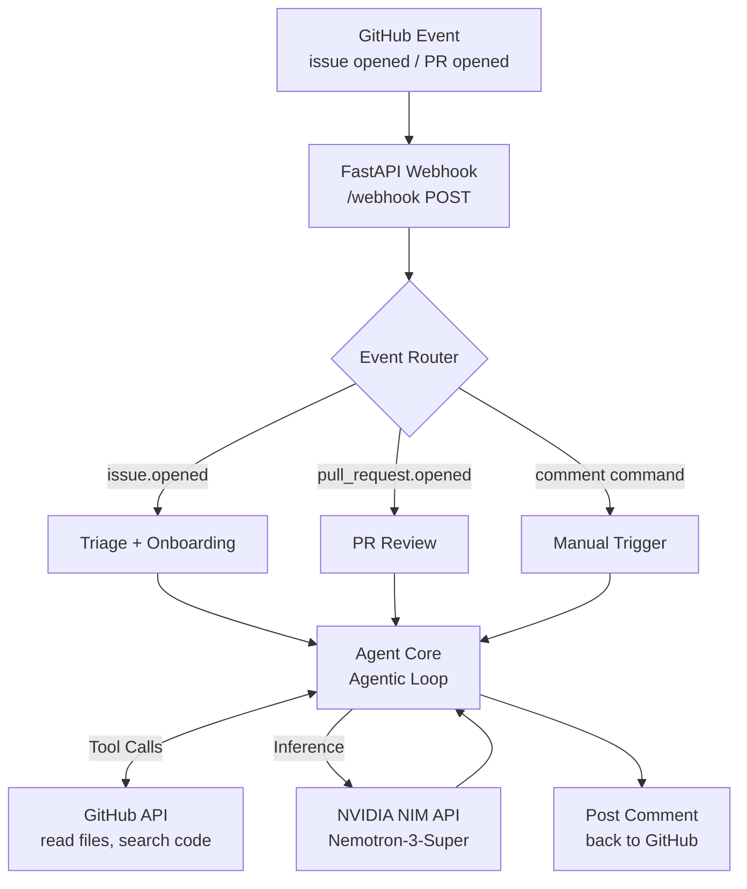

# MaintainerCopilot


**AI-powered GitHub App that triages issues, generates reproduction steps, onboards newcomers, and reviews PRs — powered by NVIDIA Nemotron-3-Super.**

---

## The Problem

Small open-source projects, nonprofits, and civic-tech teams are run by a handful of maintainers who wear every hat. Every new issue, every unanswered PR, every first-time contributor who doesn't know where to start — it all lands on the same two or three people. Maintainer burnout is real, and it's killing good projects.

MaintainerCopilot is a GitHub App that installs in one click and becomes your always-on AI co-maintainer. It reads your actual codebase before it responds — no hallucinated file paths, no generic advice.

---

## Architecture



---

## Features

### 🤖 Issue Triage
Opens automatically on every new issue. Reads the README and searches the codebase, then posts a structured triage report: category, severity, suggested labels, relevant files, and next steps.

### 🔬 Reproduction Steps
For bug reports, the agent reads the relevant source files and generates step-by-step reproduction instructions grounded in the actual code path — not generic advice.

### 👋 Newcomer Onboarding
When triage identifies a `good-first-issue`, a friendly contributor guide is posted automatically: where the code lives, how to run it locally (extracted from the README), and what a good fix looks like.

### 🔍 PR Review
On every opened or updated PR, the agent reads each changed file and the surrounding context, then posts a structured review: summary, potential concerns, positive observations, and a merge checklist.

### 📋 Release Note Drafter
Triggered by `/copilot release-notes` or a tagged push. Reads merged PRs and drafts categorized release notes.

---

## Quick Start

```bash
# Step 1: Clone the repo
git clone https://github.com/your-org/maintainer-copilot.git
cd maintainer-copilot

# Step 2: Configure your environment
cp .env.example .env
# Edit .env — fill in NVIDIA_API_KEY, GITHUB_APP_ID, GITHUB_WEBHOOK_SECRET

# Step 3: Launch the server
docker compose up

# Step 4: Install the GitHub App on your repository
# Follow scripts/setup_github_app.md — takes ~5 minutes
```

For local development with a public webhook URL:
```bash
docker compose --profile dev up
# ngrok tunnel URL shown at http://localhost:4040
```

---

## Manual Commands

Comment on any issue or PR to trigger features on demand:

| Command | Description |
|---|---|
| `/copilot triage` | Re-run triage on this issue |
| `/copilot repro` | Generate reproduction steps |
| `/copilot onboard` | Generate newcomer contributor guide |
| `/copilot review` | Re-run PR review |
| `/copilot release-notes` | Draft release notes |
| `/copilot help` | Show all commands |

---

## Why NVIDIA Nemotron-3-Super?

MaintainerCopilot's value comes from grounding every response in the actual repository. This requires a model that can:

1. **Plan a multi-step investigation** — deciding which files to read, which terms to search, in what order
2. **Call tools reliably in a loop** — the agentic loop runs up to 10 iterations of tool calls before producing a final answer
3. **Reason across large contexts** — a real codebase has hundreds of files; the model must synthesize information from multiple reads into a coherent response

NVIDIA Nemotron-3-Super (49B parameters) excels at exactly this: long-horizon agentic reasoning, reliable function/tool calling, and producing structured, grounded output. Smaller models hallucinate file paths; Nemotron-3-Super reads the files first.

---

## Environment Variables

See `.env.example` for the full list. Key variables:

```env
NVIDIA_API_KEY=       # NVIDIA NIM API key
GITHUB_APP_ID=        # Your GitHub App's numeric ID
GITHUB_WEBHOOK_SECRET=# Secret used to verify webhook payloads
GITHUB_PRIVATE_KEY_PATH=./github_private_key.pem
```

Feature flags (all default `true`):
```env
FEATURE_TRIAGE=true
FEATURE_REPRODUCTION=true
FEATURE_ONBOARDING=true
FEATURE_PR_REVIEW=true
FEATURE_RELEASE_NOTES=true
```

---

## Development

```bash
# Install dev dependencies
pip install -r requirements-dev.txt

# Run tests
pytest

# Lint
ruff check app/ tests/

# Send a test webhook locally
./scripts/test_local.sh issue
./scripts/test_local.sh pr
./scripts/test_local.sh comment
```

---

## Contributing

See [CONTRIBUTING.md](CONTRIBUTING.md) for how to set up the dev environment, run tests, add new features, and submit a PR.

---

## License

[MIT](LICENSE)

---

## Contest

This project is submitted under the **Community Impact — Open Source Tooling** track of the **NVIDIA × Collabnix Open-Source Maintainer Copilot Contest**.
