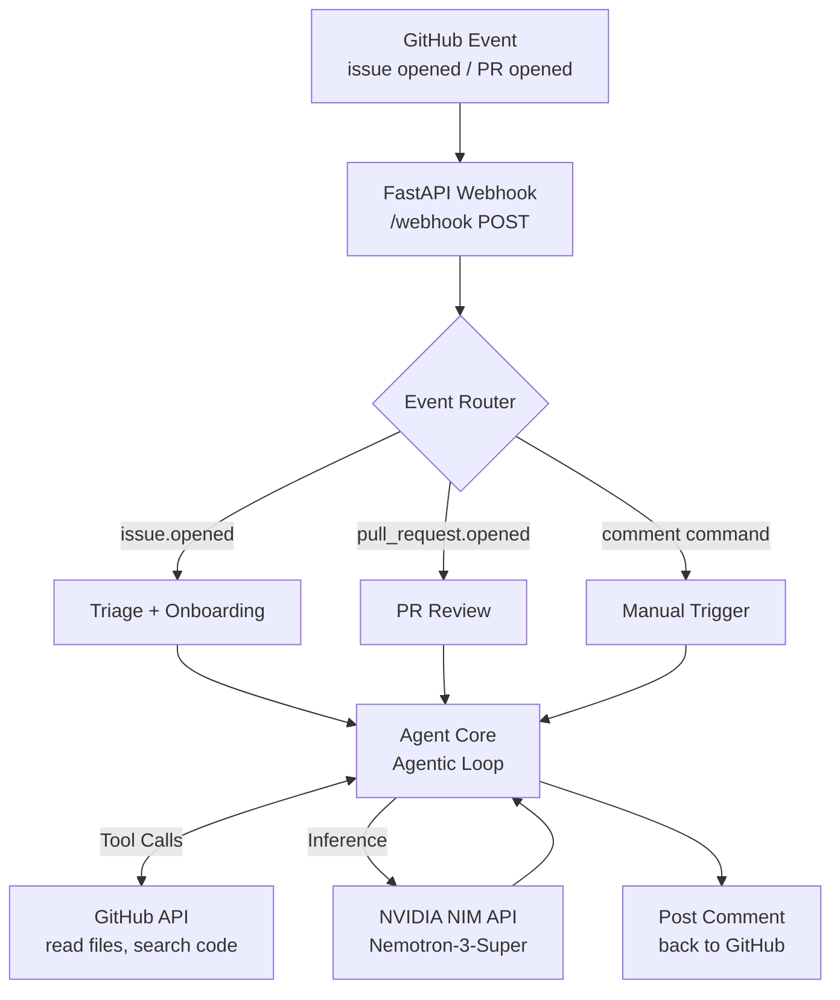

# Open-Source-Warden


> An AI GitHub App for open-source projects. Triages issues, reviews pull requests, guides new contributors, and drafts release notes — powered by NVIDIA Nemotron-3-Super (49B).


---

## Install in One Click

[](https://github.com/apps/open-source-warden)

Pick your repository, click Install, and the bot starts working immediately — no config, no server to run. Once it's in:

- Open an issue and it posts a triage report within seconds
- Open a PR and it reviews every changed file
- Comment `/copilot help` to see what else it can do

[](https://youtu.be/VIDEO_ID_INSTALL)

> Self-hosting instructions are below if you want to run your own instance.

---

## Why this exists

Most open-source projects are maintained by two or three people who handle everything — triaging issues, reviewing PRs, answering the same "how do I get started?" question from every new contributor. It compounds fast, and burnout follows.

Open-Source-Warden plugs into your repo as a GitHub App and handles the first-response layer. It reads your actual codebase before it replies — so the triage report references real files, the reproduction steps follow real code paths, and the onboarding guide points to the right directory. It doesn't guess.

---

## Live Demo — Powered by Railway

See the agent running live: a new GitHub issue triggers the full triage pipeline on a real repository deployed on Railway.

<video src="https://github.com/user-attachments/assets/f1cdd610-9480-4340-ab45-2c3712076d60" controls width="100%"></video>

---


## What it does

### Issue Triage

Every new issue gets a triage report automatically: severity, category, suggested labels, relevant source files, and recommended next steps. Maintainers can skip the read-and-classify step entirely.

[](https://youtu.be/VIDEO_ID_TRIAGE)

---

### Reproduction Steps

For bug reports, the agent traces the relevant code path and writes step-by-step reproduction instructions grounded in what the code actually does — not boilerplate advice.

[](https://youtu.be/VIDEO_ID_REPRO)

---

### Newcomer Onboarding

When an issue is tagged `good-first-issue`, the bot posts a contributor guide: where the code lives, how to run it locally, and what a clean fix would look like. New contributors get unblocked without pinging a maintainer.

[](https://youtu.be/VIDEO_ID_ONBOARD)

---

### PR Review

Every opened or updated pull request gets a structured review: what changed, potential concerns, things done well, and a merge checklist. The agent reads the actual diff and surrounding context before commenting.

[](https://youtu.be/VIDEO_ID_REVIEW)

---

### Release Notes

Triggered by `/copilot release-notes` or a version tag push. Reads merged PRs since the last release and drafts categorised release notes ready to publish.

[](https://youtu.be/VIDEO_ID_RELEASE)

---

## How it works



GitHub sends a webhook event → FastAPI routes it → the agent reads your codebase using GitHub API tools → calls Nemotron-3-Super via NVIDIA NIM → posts the result as a comment. The agentic loop runs up to 10 tool-call iterations before producing a final answer, which is what lets it chase down real file paths rather than guessing.

---

## Self-hosting

You'll need two things before running:

| What | Where to get it | Takes |
|---|---|---|
| NVIDIA API Key | [build.nvidia.com](https://build.nvidia.com) → any model → Get API Key | ~3 min |
| ngrok Auth Token | [ngrok.com](https://ngrok.com) → Dashboard → Your Authtoken | ~2 min |

Everything else is pre-configured. The setup wizard handles the rest.

### Option A — Python

```bash
git clone https://github.com/V-S-Pranay/Open-Source-Warden.git
cd Open-Source-Warden
python start.py
```

The wizard installs dependencies, walks you through the two credentials above, starts ngrok, updates the webhook URL, and launches the server. Takes about five minutes end to end.

### Option B — Docker

```bash
git clone https://github.com/V-S-Pranay/Open-Source-Warden.git
cd Open-Source-Warden
python docker_start.py
```

Same wizard, but builds a Docker image and runs both the app and ngrok as containers. Requires Docker Desktop to be installed and running.

To stop: `docker compose --profile dev down`

---

## Manual commands

Comment on any issue or PR to trigger a feature on demand:

| Command | What it does |
|---|---|
| `/copilot triage` | Re-runs triage on this issue |
| `/copilot repro` | Generates reproduction steps |
| `/copilot onboard` | Posts a newcomer contributor guide |
| `/copilot review` | Re-runs PR review |
| `/copilot release-notes` | Drafts release notes |
| `/copilot help` | Lists all commands |

---

## Why Nemotron-3-Super

The core of this project is an agentic loop that reads real files before it writes anything. That requires a model that can plan a multi-step investigation, call tools reliably across several iterations, and synthesise information from many file reads into something coherent.

Nemotron-3-Super (49B) was chosen because it handles all three well. Smaller models tend to hallucinate file paths or give up mid-loop. Nemotron follows the code.

---

## Configuration

All settings live in `.env`. Copy `.env.example` to get started. The key ones:

```env
NVIDIA_API_KEY=               # your NIM key
GITHUB_APP_ID=                # filled automatically by the wizard
GITHUB_WEBHOOK_SECRET=        # filled automatically by the wizard
GITHUB_PRIVATE_KEY_PATH=./github_private_key.pem
```

Features can be toggled individually:

```env
FEATURE_TRIAGE=true
FEATURE_REPRODUCTION=true
FEATURE_ONBOARDING=true
FEATURE_PR_REVIEW=true
FEATURE_RELEASE_NOTES=true
```

---

## Development

```bash
pip install -r requirements-dev.txt

pytest                          # run tests
ruff check app/ tests/          # lint

# fire a test webhook locally
./scripts/test_local.sh issue
./scripts/test_local.sh pr
./scripts/test_local.sh comment
```

---

## Contributing

See [CONTRIBUTING.md](CONTRIBUTING.md) for how to set up the dev environment, add a new feature, and open a PR.

---

## License

[MIT](LICENSE)

---

## Contest

Submitted to the **NVIDIA × Collabnix Open-Source Maintainer Copilot Contest** under the Community Impact — Open Source Tooling track.

---

*Built by [Vuriti Sai Pranay](https://github.com/V-S-Pranay) and Suryanarayana Reddy*
